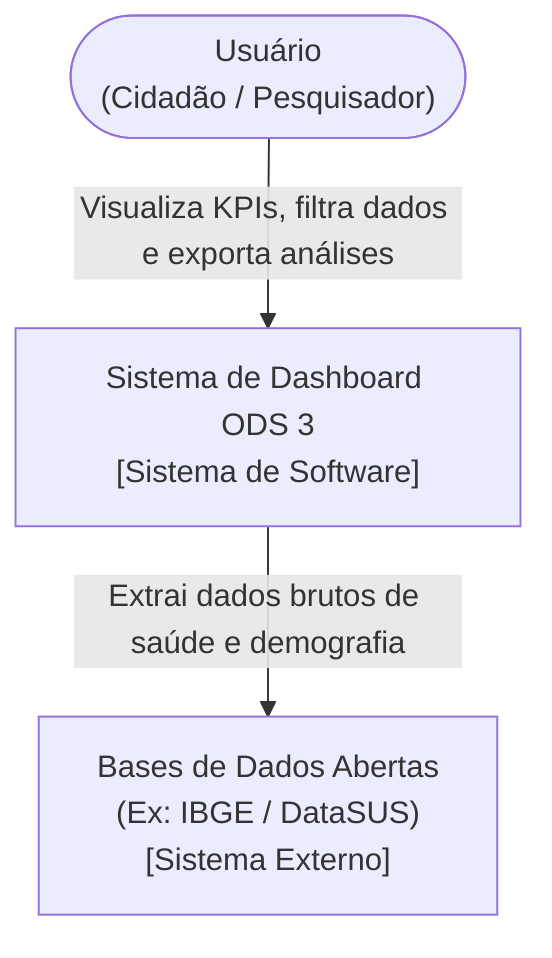

# Projeto de Arquitetura de Software

Esta página descreve a arquitetura do Dashboard de Dados (ODS 3) utilizando o padrão C4 Model, detalhando as escolhas tecnológicas e a estrutura do sistema.

## 1. Escolhas de Tecnologias (i)

Para o desenvolvimento desta solução, optamos por uma stack focada em engenharia e análise de dados:

* **Linguagem Principal:** Python 3.10+
* **Processamento de Dados:** Biblioteca `pandas` para a criação de rotinas de ETL (Extração, Transformação e Carga), permitindo a higienização e cruzamento dos dados de saúde pública de forma otimizada.
* **Frontend / Interface:** `Streamlit`. Esta biblioteca permite a construção de interfaces web interativas diretamente em Python, ideal para dashboards analíticos.
* **Armazenamento:** Arquivos estáticos estruturados (`.csv` ou `.parquet`) atuando como base de dados analítica local, garantindo leveza e facilidade de leitura pelas rotinas do pandas.

## 2. Projeto Arquitetural (C4 Model) (ii)

Abaixo estão os diagramas representando os Níveis 1 (Contexto de Sistema) e 2 (Contêiner) da nossa aplicação.

### Nível 1: Diagrama de Contexto
Visão de alto nível de como o usuário interage com o sistema e de onde os dados vêm.

### Nível 2: Diagrama de Container

flowchart TD
    User(["Usuário\n(Cidadão / Pesquisador)"])
    
    subgraph System["Sistema de Dashboard ODS 3"]
        UI["Aplicação Web (Frontend)\n[Streamlit / HTML / CSS]\nInterface interativa de visualização"]
        Backend["Lógica de Processamento (Backend)\n[Python / Pandas]\nFiltra, agrega e processa os dados sob demanda"]
        Storage["Armazenamento de Dados\n[Arquivos CSV/Parquet]\nBases de dados higienizadas prontas para leitura"]
    end

    User -- "Acessa pelo navegador, interage com gráficos" --> UI
    UI -- "Solicita dados filtrados" --> Backend
    Backend -- "Retorna dados processados/gráficos" --> UI
    Backend -- "Lê dados estruturados" --> Storage

## 3. Justificativa do Modelo Escolhido (iii)
O modelo arquitetural escolhido segue uma abordagem cliente-servidor leve, acoplada por meio do framework Streamlit.

A escolha dessa arquitetura justifica-se pelo escopo da aplicação e pela natureza do problema (análise de dados). Separar a extração bruta (sistemas externos) de um armazenamento local em arquivos formatados (.csv/.parquet) simula um ambiente de Data Lake simplificado. O uso do Python no backend gerenciando a interface via Streamlit elimina a necessidade de criar APIs complexas (REST/GraphQL) e hospedar servidores web separados, o que reduz a complexidade da gerência de configuração, sem perder a robustez no processamento analítico dos dados.
